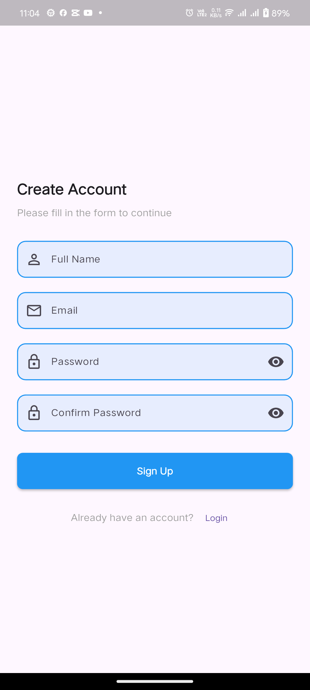
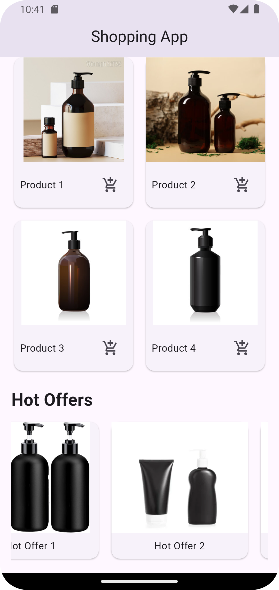

# Flutter Shopping App Interface

A modern shopping app interface created with Flutter, featuring a secure signup process and an intuitive shopping interface.

## Features

### Authentication
- Secure signup screen with form validation:
    - Full name with capitalized first letter validation
    - Email format validation (@)
    - Password minimum length (6 characters)
    - Password confirmation matching
    - Real-time validation feedback via SnackBar
    - Success confirmation dialog

### Shopping Interface
- Responsive design using MediaQuery
- Product carousel using PageView
- Product grid with add to cart SnackBar notifications
- Horizontal scrollable hot offers list

## Code Structure

The code is organized into separate modules for better maintainability:

### Core Files
- `lib/main.dart`: App entry point with theme configuration

### Screens
- `lib/screens/`
    - `signup_screen.dart`: User registration interface
    - `home_screen.dart`: Main shopping interface

### Widgets
- `lib/widgets/signUp/`
    - `signup_form_field.dart`: Reusable form input component
    - `signup_button.dart`: Custom signup button
- `lib/widgets/shopping/`
    - `product_page_view.dart`: Product carousel
    - `product_grid.dart`: Products display grid
    - `hot_offers_list.dart`: Horizontal offers list

### Utils
- `lib/utils/`
    - `dialog_utils.dart`: Dialog components
    - `snackbar_utils.dart`: Notification components
    - `style_constants.dart`: App styling constants

## How to Run

1. Clone the repository
2. Run `flutter pub get`
3. Run `flutter run`

## Screenshots

| Signup Screen | Shopping Home | Hot Offers |
|---|---|---|
|  |  |  |

## Implementation Details

### Signup Screen
- Centered form layout with card design
- Real-time validation feedback
- Secure password input with visibility toggle
- Success dialog with navigation to shopping screen

### Shopping Interface
- Dynamic product carousel
- Interactive product grid with cart functionality
- Responsive hot offers section
- Clean and intuitive UI design

## Future Improvements

- Implement login functionality
- Add user profile management
- Integrate with backend services
- Add product details screen
- Implement checkout process