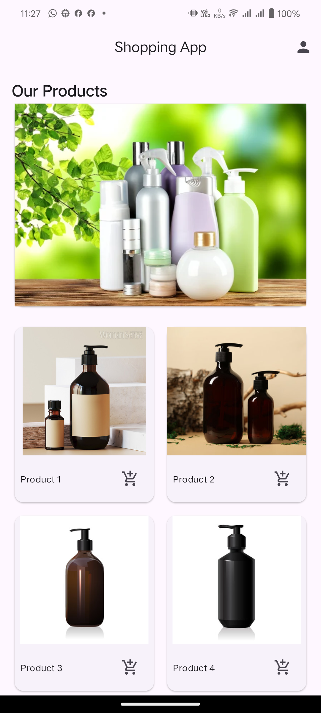
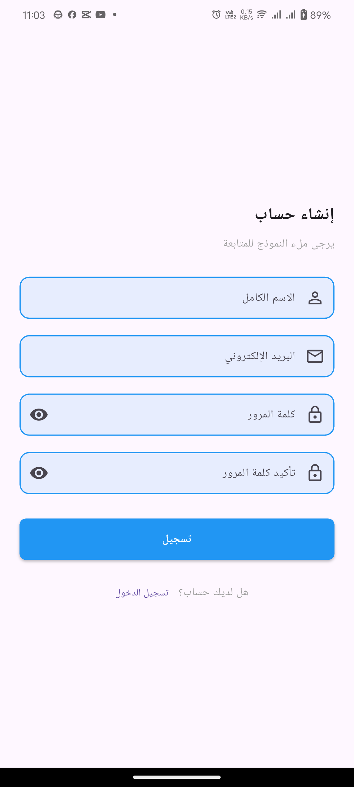

# Flutter Shopping App Interface

A modern shopping app interface created with Flutter, featuring animated transitions, secure signup, and featuring localization support for English and Arabic.

## Features
- Email & Password Authentication
- Login Screen
- Sign Up Screen
- Form Validation
- Error Handling
- Loading States
- Secure Password Storage
- Navigation Flow
- Firebase Authentication
- Biometric Authentication
- Profile Management
- Secure Profile Access

## Firebase Setup
1. Create a Firebase project
2. Enable Email/Password authentication
3. Add your Firebase configuration
4. Install Firebase CLI
5. Initialize Firebase in your Flutter project

### Localization
- Full support for English and Arabic languages
- RTL layout support for Arabic
- Localized strings for all UI elements
- Easy to add more languages

### Animations
- Smooth fade transition between signup and shopping screens
- Custom page route animation implementation
- Professional screen transitions

### Authentication
- Secure signup screen with form validation:
  - Full name with capitalized first letter validation
  - Email format validation (@)
  - Password minimum length (6 characters)
  - Password confirmation matching
  - Real-time validation feedback via SnackBar
  - Success confirmation dialog

### Shopping Interface
- Responsive design using MediaQuery
- Product carousel using PageView
- Product grid with add to cart SnackBar notifications
- Horizontal scrollable hot offers list

## Code Structure
The code is organized into separate modules for better maintainability:

### Core Files
- `lib/main.dart`: App entry point with theme configuration

### Screens
- `lib/screens/`
  - `signup_screen.dart`: User registration interface
  - `home_screen.dart`: Main shopping interface
  - 'login_screen.dart': User login interface

### Animations
- `lib/animations/`
  - `fade_page_route.dart`: Custom fade transition

### Widgets
- `lib/widgets/signUp/`
  - `signup_form_field.dart`: Reusable form input component
  - `signup_button.dart`: Custom signup button
- `lib/widgets/shopping/`
  - `product_page_view.dart`: Product carousel
  - `product_grid.dart`: Products display grid
  - `hot_offers_list.dart`: Horizontal offers list

### Utils
- `lib/utils/`
  - `dialog_utils.dart`: Dialog components
  - `snackbar_utils.dart`: Notification components
  - `style_constants.dart`: App styling constants

## Animation Implementation

The app uses custom page route transitions to create smooth animations:
- FadePageRoute: Creates a fade transition between screens
- Duration: 400 milliseconds for optimal user experience
- Smooth opacity animation from 0 to 1

## Localization Implementation
The app implements localization using:
- Custom AppLocalizations class
- Localization delegate
- Support for English and Arabic
- RTL layout support
- Centralized string management

## How to Run

1. Clone the repository
2. Run `flutter pub get`
3. Run `flutter run`

## Screenshots

| Shopping Home Arabic | Shopping Home |
|---|---|
|  |  |

| Signup Screen | Signup Screen Arabic | Login Screen | Login Screen Arabic |
|---|---|---|---|
|  |  |  |  |

| Profile Page                        |
|-------------------------------------|
|  |
## Implementation Details

### Animation
- Custom PageRouteBuilder implementation
- Smooth fade transition effect
- Configurable animation duration
- Clean animation code structure

### Signup Screen
- Centered form layout with card design
- Real-time validation feedback
- Secure password input with visibility toggle
- Success dialog with animated navigation

### Shopping Interface
- Dynamic product carousel
- Interactive product grid with cart functionality
- Responsive hot offers section
- Clean and intuitive UI design

## Future Improvements

- Add more animation types
- Implement login functionality
- Add user profile management
- Integrate with backend services
- Add product details screen
- Implement checkout process